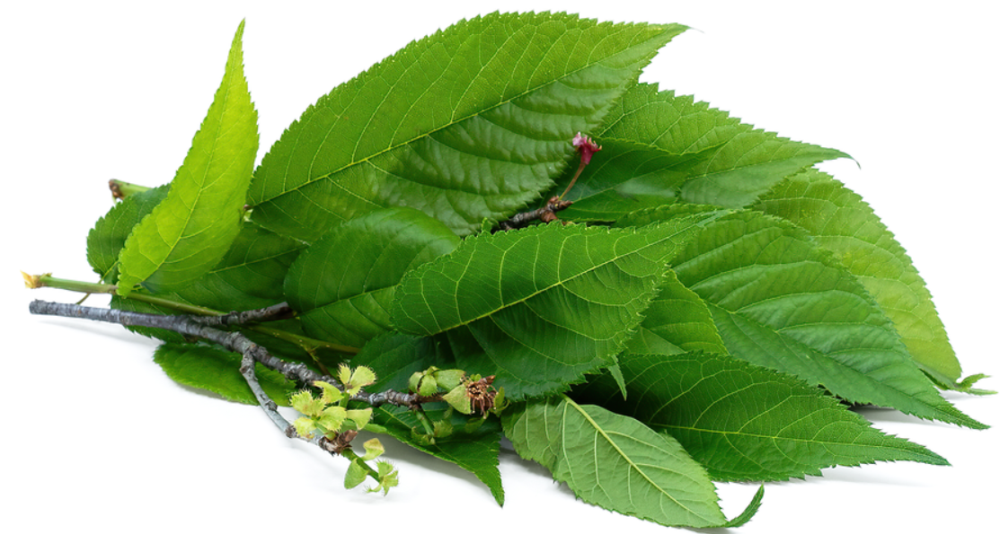

## Table of contents


- [Table of contents](#table-of-contents)
- [Introduction](#introduction)
- [Dataset Content](#dataset-content)
- [Business Requirements](#business-requirements)
- [Epics and User Stories](#epics-and-user-stories)
  - [Epic - Information Gathering and Data Collection](#epic---information-gathering-and-data-collection)
  - [Epic - Data Visualization, Cleaning, and Preparation](#epic---data-visualization-cleaning-and-preparation)
  - [Epic - Model Training, Optimization and Validation](#epic---model-training-optimization-and-validation)
  - [Epic - Dashboard Planning, Designing, and Development](#epic---dashboard-planning-designing-and-development)
  - [Epic - Dashboard Deployment and Release](#epic---dashboard-deployment-and-release)
- [The rationale to map the business requirements to the Data Visualisations and ML tasks](#the-rationale-to-map-the-business-requirements-to-the-data-visualisations-and-ml-tasks)
- [Dashboard Design (Streamlit App User Interface)](#dashboard-design-streamlit-app-user-interface)
  - [Page 1: Quick Project Summary](#page-1-quick-project-summary)
  - [Page 2: leaves Visualizer](#page-2-leaves-visualizer)
  - [Page 3: Powdery mildew Detector](#page-3-powdery-mildew-detector)
  - [Page 4: Project Hypothesis and Validation](#page-4-project-hypothesis-and-validation)
  - [Page 5: ML Performance Metrics](#page-5-ml-performance-metrics)
- [Render deployment](#render-deployment)
- [Main Data Analysis and Machine Learning Libraries](#main-data-analysis-and-machine-learning-libraries)
- [Other Technologies used](#other-technologies-used)
- [Issues](#issues)
- [Testing](#testing)
  - [Manual Testing](#manual-testing)
  - [Python Validation](#python-validation)
- [Credits](#credits)
  - [Content](#content)
- [Acknowledgements](#acknowledgements)


## Introduction

Mildew detection in cherry leaves is a data science and machine learning (ML) project that uses predictive analytics to tell the difference between 2 different sets of images. The business goal is to assist the client, an agri-food business who is dealing with an infestation of powdery mildew in its cherry tree plantations. 

Currently the client is inspecting trees manually to determine whether they are infected or not and then treated if found to be diseased. This process is both labour intensive and time consuming. We propose the creation of a ML model that can determine from photographs of leaves whether mildew is present, reducing the amount of time taken to determine the status of the tree and enable sick trees to be treated with greater efficiency and accuracy. 

The project is hosted on the streamlit app and a live version may be found [here](https://mildew-detection-in-cherry-leaves-pm2j.onrender.com/)


## Dataset Content

- The dataset is sourced from [Kaggle](https://www.kaggle.com/codeinstitute/cherry-leaves). 
- - The dataset contains over 4 thousand images taken from the client's cherry tree plantations. The images are divided into 2 sets, one of healthy leaves and one of leaves that are infected with powdery mildew. a fungal disease that affects many plant species. The client is concerned that the outbreak may be compromising the quality of their crop, which in turn would have serious ramifications for their business at large. 

[Back to top](#table-of-contents)

## Business Requirements

This project's main objective is to create a machine learning model that can detect whether a given tree has powdery mildew or not based on photographs uploaded to the dashboard as opposed to manual inspections of each tree, reducing costs in time and labour. This will result in more effective treatment and prevent a decline in crop quality. 

Key stakeholders for this are Farmy & Foods themselves, and their customers.

When considering the business requirements and how to meet them, attention must be paid to the following:

* The ML model produced must be accurate in its predictions of whether a leaf is infected or not
* The model should be able to handle multiple items concurrently
* The results produced from uploads must be easy to understand for both technical and non-technical personnel.
* The model must be able to return a prediction quickly

The specific requirements are as follows:

1. The client is interested in conducting a study to visually differentiate a healthy cherry leaf from one with powdery mildew. This should provide average images of both kinds of leaves, as well as a variability image for each.
2. The client is interested in predicting if a cherry leaf is healthy or contains powdery mildew. To meet this requirement, a Convolutional Neural Network (CNN) should be developed to classify images as healthy or infected.

[Back to top](#table-of-contents)

## Epics and User Stories
* The project was split into 5 Epics based upon the Data Visualisation and Machine Learning tasks and within each of these, user stories were set out to enable an agile methodology.

### Epic - Information Gathering and Data Collection
* **User Story** -  I can import the dataset from Kaggle so that I can save the data in a local directory.
* **User Story** -  I can load a saved dataset so that I can analyse the data to gain insights.

### Epic - Data Visualization, Cleaning, and Preparation
* **User Story** -  I can visualise the dataset so that I can interpret which attributes correlates with Mildew.
* **User Story** -  I can impute or drop missing data to prepare the dataset for a ML model.

### Epic - Model Training, Optimization and Validation
* **User Story** -  I can split the data into a train, validate and test set to prepare it for the ML model.
* **User Story** -  I can fit a ML pipeline with all the data to prepare the ML model for deployment.
* **User Story** - As a data scientist, I can evaluate the ML model's performance to determine whether it can successfully predict Mildew .

### Epic - Dashboard Planning, Designing, and Development
* **User Story** -  I can view a project summary that describes the project, dataset and business requirements to understand the project at a glance.
* **User Story** -  I can view the project hypotheses and validations to determine what the project was trying to achieve and whether it was successful.
* **User Story** -  I can enter unseen data into the model and receive a prediction.
* **User Story** -  I can view the correlation analysis to see how the outcomes were reached.
* **User Story** - As a non-technical user, I can view the project conclusions to see whether the model was successful and if the business requirements were met.

### Epic - Dashboard Deployment and Release
* **User Story** - As a user, I can view the project dashboard on a live deployed website.
* **User Story** - As a technical user, I can follow instructions in the readme to fork the repository and deploy the project for myself.

[Back to top](#table-of-contents)


## The rationale to map the business requirements to the Data Visualisations and ML tasks

In this project, we aimed to balance accuracy, speed, scalability, and interpretability of results. The following outlines how the defined business requirements were addressed through data processing, machine learning, and dashboard development.

Requirement 1 – Visual Differentiation of Healthy vs. Infected Cherry Leaves

The client requested a study to determine whether healthy cherry leaves could be visually distinguished from those infected with powdery mildew. This was approached as a classification problem, with supporting data visualisation and ML analysis tasks.

* Related User Stories
  - As a data scientist, I can collect and prepare data so that it can be used for analysis and model training.
    - Relevant datasets were sourced from Kaggle and thoroughly cleaned to ensure data quality. Non-image files were removed via a preprocessing notebook.
    - Images were converted to arrays, and statistical analyses were conducted to compare average pixel intensities and variability between healthy and diseased leaves.
    - The results demonstrated visual patterns that differentiate the two classes, validating the hypothesis.

* As an end user, I can review a page of project findings to understand the conclusions of the analysis.
  - The Image Visualizer page on the dashboard presents the study’s results, including:
    -Average images for both healthy and diseased leaves
    - Variability maps
    - A comparative visual showing the differences between both conditions
  - Users can also view image montages of each class for better context and understanding.

* As an end user, I can view a page detailing the project hypothesis to understand the reasoning behind the developer's analysis.
  - The project hypothesised that there are identifiable visual differences between healthy and mildew-affected leaves, which was confirmed through statistical and visual analysis.

Requirement 2 – Prediction of Leaf Health Status

The client also requested a predictive tool capable of determining whether an uploaded leaf image shows signs of powdery mildew.

Related User Stories

* As a data scientist, I can create a machine learning model to make predictions on uploaded images.
  - A Convolutional Neural Network (CNN) was trained to classify images as healthy or infected.
  - The model architecture incorporated multiple convolutional and activation layers to maximise classification accuracy.
  - The resulting model was integrated into the dashboard for real-time inference.

* As an end user, I can upload an image of a leaf to determine if it is diseased.
  - The Mildew Detector page allows users to upload leaf images directly.
  - The uploaded image is processed through the trained CNN, which provides an accurate prediction of the leaf’s health status, along with a clear visual output.

* Summary
  - Together, these requirements ensure that:
  - The data analysis confirms visual differentiation between healthy and infected leaves.
  - The machine learning model operationalises this differentiation for real-time prediction.
  - The dashboard interface enables users to interact intuitively with both study results and predictive tools.


- ## ML Business Case

The client has requested a solution that will enable them to quickly and efficiently differentiate between healthy & diseased leaves. This will be done by creating a ML model.

The aim behind the ML task is to develop a ML model using a CNN that is able to distinguish a cherry leaf that is healthy from one that has powdery mildew. 

Ultimately, the goal is to develop a binary classification model that can predict with minimum 97% accuracy whether a leaf is infected or not, outputting an appropriate label for the status of a given leaf. Once output has been received, the tree in question may be recommended for treatment.

We may consider this successfully accomplished if it is capable of achieving an accuracy rating of at least 97% on the test dataset. If this is not accomplished, the model has failed. A high accuracy rating is crucial as failure to detect disease may have serious economic implications for the client.

The relevance to the user of this kind of ML model output is that it may be relied upon to deliver trustworthy readings when presented with new data. In addition, the model will output visuals such as the average image for healthy and sick leaves, which will provide a useful reference to the users.

The data is provided by the user and downloaded from Kaggle. It is split into train, test and validation subsets. It is confidential in nature and as such appropriate measures will be taken to protect it. It may only be downloaded from Kaggle if the data practitioner has the appropriate JSON key.

[Back to top](#table-of-contents)

## Dashboard Design (Streamlit App User Interface)

### Page 1: Quick Project Summary
- Quick project summary
    - General Information:
        - Powdery mildew is a parasitic fungal disease caused by Podosphaera clandestina in cherry trees. When the fungus begins to take over the plants, a layer of mildew made up of many spores forms across the top of the leaves. The disease is particularly severe on new growth, can slow down the growth of the plant and can infect fruit as well, causing direct crop loss.
        - Visual criteria used to detect infected leaves are light-green, circular lesion on either leaf surface and later on a subtle white cotton-like growth develops in the infected area on either leaf surface and on the fruits thus reducing yield and quality."
- Project Dataset
The available dataset provided by Farmy & Foody contains 4208 featured photos of single cherry leaves against a neutral background. The leaves are either healthy or infested by cherry powdery mildew.
- Business requirements:
    1. The client is interested to have a study to visually differentiate between a parasite-contained and uninfected leaf.
    2. The client is interested in telling whether a given leaf contains a powdery mildew parasite or not.
    3. The client is interested in obtaining a prediction report of the examined leaves. 
- Link to this Readme.md file for additional information about the project. 

### Page 2: leaves Visualizer
It will answer business requirement #1
- Checkbox 1 - Difference between average and variability image
- Checkbox 2 - Differences between average parasitised and average uninfected leaves
- Checkbox 3 - Image Montage
- Link to this Readme.md file for additional information about the project. 

### Page 3: Powdery mildew Detector
- Business requirement #2 and #3 information - "The client is interested in telling whether a given leaf is infected with powdery mildew or not and obtaining a downloadable report of the examined leaves."
- Link to download a set of parasite-contained and uninfected leaf images for live prediction on [Kaggle](https://www.kaggle.com/datasets/codeinstitute/cherry-leaves)
- User Interface with a file uploader widget. The user can upload multiple cherry leaves images. It will display the image, a barplot of the visual representation of the prediction and the prediction statement, indicating if the leaf is infected or not with powdery mildew and the probability associated with this statement.
- Table with the image name and prediction results.
- Download button to download the report in a ```.csv``` format. 
- Link to this Readme.md file for additional information about the project. 
  
### Page 4: Project Hypothesis and Validation
- Block for each project hypothesis including statement, explanation, validation and conclusion. See [Hypothesis and validation](#Hypothesis-and-validation)
- Link to this Readme.md file for additional information about the project. 

### Page 5: ML Performance Metrics
- Label Frequencies for Train, Validation and Test Sets
- Dataset percentage distribution among the three sets
- Model performance - ROC curve
- Model accuracy - Confusion matrix
- Model History - Accuracy and Losses of LSTM Model
- Model evaluation result on Test set

[Back to top](#table-of-contents)


## Render deployment 

1. Add new
2. Web service
3. connect to github
4. Choose the right repo 
5. Start command streamline run app.py 
6. Deploy


[Back to top](#table-of-contents)

## Main Data Analysis and Machine Learning Libraries
The main libraries used were: 
* numpy 1.26.1 - used to convert information to arrays
* pandas 2.1.1 - used for converting information to a dataframe and saving as such
* matplotlib 3.4.0 - used to plot the distribution of datasets
* seaborn 0.13.2 - used for making statistical graphics
* plotly 5.10.0 - used for plotting results of ML model training
* Pillow 10.0.1 - used to adjust images
* streamlit 1.40.2 - used to create the dashboard's interface
* joblib 1.4.2 - used for runnning tasks in parallel
* scikit-learn 1.3.1 - used for model evaluation
* tensorflow-cpu 2.16.1 - used for model creation
* keras 3.0.0 - used to set hyperparameters for the model

[Back to top](#table-of-contents)

## Other Technologies used

* Streamlit - used for dashboard development to present data and for final project delivery

* Render - used to deploy the project as a web app.

* Git/GitHub - used for version control and code storage

* Gitpod - IDE used to develop the project


[Back to top](#table-of-contents)

## Issues

* Project was to big for heroku so used Render.

* Dont know exactly what happend but everything crashed 2025-10-11 so did a new repository thats why this is so new.(But had my code still just new repo)

* Deployment - When attempting to deploy the app, it was discovered that it was too large to be posted. Despite adding a number of items to the .slugignore, it was still too large. To find more space, older versions of some libraries were used, and the python version selected was changed from 3.12 to 3.9, and some images had to be removed from the validation set posted to the dashboard that is used for the image visualiser page.


## Testing

### Manual Testing

| Dashboard item | Test conducted | Expected result | Actual result |
| -- | -- | -- | -- |
| Navbar | Selecting button for Image Visualiser | Image Visualiser page opens | Success |
| Button for difference between average & variability image | Click button | Display average & variability image for healthy & infected leaves | Success |
| Button for difference between average healthy & infect leaves | Click button | Display both average images & difference image for average healthy & infect leaves | Success |
| Button for image montage | Click button | Display dropdown for montage creation | Success |
| Dropdown option for healthy leaves | Select & click button to create montage | See montage of healthy leaves| Success |
| Dropdown option for infected leaves | Select & click button to create montage | See montage of infected leaves| Success |

* As an end user I can view a page detailing the project hypothesis so that I can understand the reasoning behind the developer's analysis

| Dashboard item | Test conducted | Expected result | Actual result |
| -- | -- | -- | -- |
| Navbar | Selecting button for Project Hypotheses | Project Hypothesis page opens | Success |

**Requirement 2** - The client is interested in predicting if a cherry leaf is healthy or contains powdery mildew.

The client wanted a dashboard that would let them upload images of leaves to the site and have an accurate reading of whether they were healthy or sick. This requirement was considered in the below user story:

* As an end user I can upload an image of a leaf so that I can learn if it is diseased or not. 

| Dashboard item | Test conducted | Expected result | Actual result |
| -- | -- | -- | -- |
| Navbar | Selecting button for Mildew Detector |Mildew Detector page opens | Success |
| Link to Kaggle on Mildew Detector page | Click on link |Kaggle page for dataset opens | Success |
| Box for uploading data | Drag & drop leaf image into box | See report displaying analysis of the image | Success |
| Box for uploading data | Use browse files button | File explorer opens to enable selection | Success |
| Box for uploading data | Upload image from file explorer | See report displaying analysis of the image | Success |
| Box for uploading data | Repeat prior two items for multiple images | See report displaying analysis of all the images| Success |
| Image analysis report | Click button to download csv report of analysis | Report is downloaded containing the results shown on dashboard| Success |

### Python Validation
The code in the Jupyter notebooks was validated using pycodestyle, which was installed through the following command:
`pip install pep8 pycodestyle pycodestyle_magic`.

It was implemented using a cell at the top of each page containing the following:

```
%load_ext pycodestyle_magic
%pycodestyle_on
```

A copy was made of each notebook, which was run with pycodestyle enabled, any errors were then corrected in the corresponding cell in the primary notebook.

[Back to top](#table-of-contents)


## Credits

### Content

- Information on powdery midlew was taken from https://en.wikipedia.org/wiki/Powdery_mildew
- The dataset was created by Code institute and taken from [Kaggle](https://www.kaggle.com/codeinstitute/cherry-leaves)
- The Malaria Walkthrough Project from Code Institute was used as a guide when assembling this project.


## Acknowledgements

- My mentor Mo Shami for his feedback, advice, and support.
- My Wife Agnes for her support, advice and help with the baby so i can take time for my project.

[Back to top](#table-of-contents)