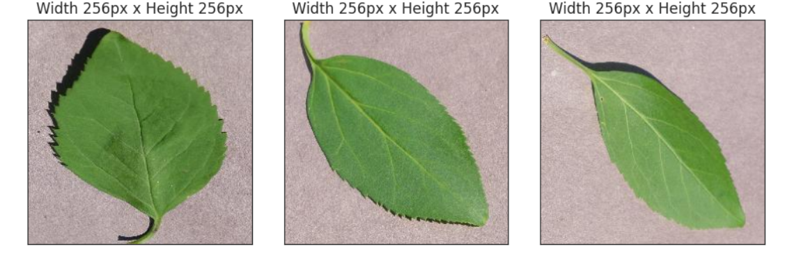
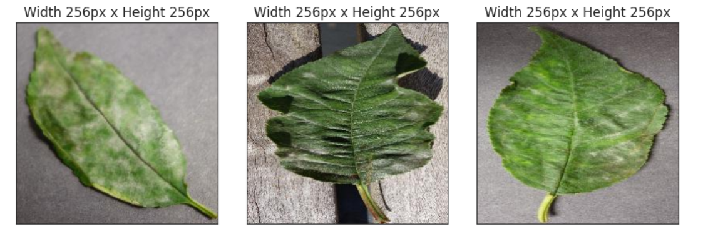
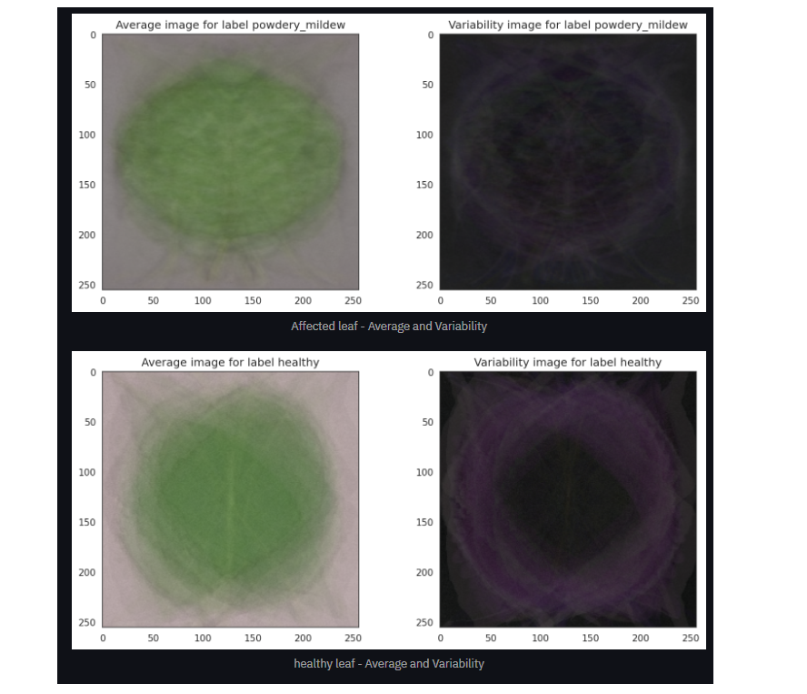
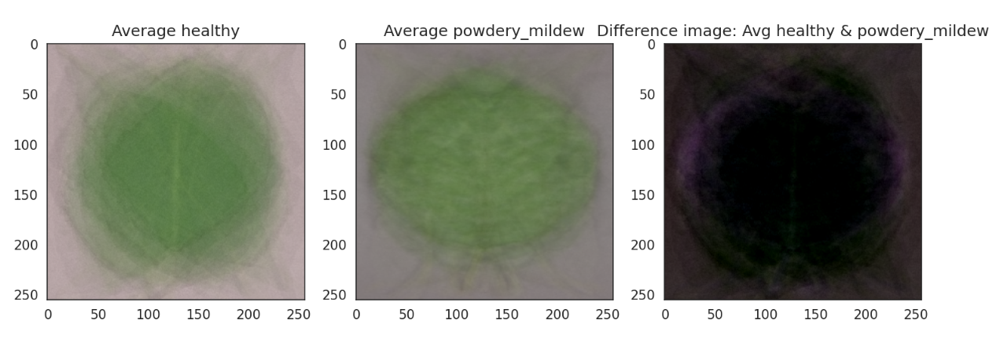

## Table of contents

- [Table of contents](#table-of-contents)
- [Introduction](#introduction)
- [Dataset Content](#dataset-content)
- [Business Requirements](#business-requirements)
- [Hypotheses](#hypotheses)
  - [Hypothesis 1](#hypothesis-1)
  - [Hypothesis 1 Validation](#hypothesis-1-validation)
  - [Hypothesis 2](#hypothesis-2)
  - [Hypothesis 2 Validation](#hypothesis-2-validation)
  - [Hypothesis 3](#hypothesis-3)
  - [Hypothesis 3 Validation](#hypothesis-3-validation)
- [The rationale to map the business requirements to the Data Visualisations and ML tasks](#the-rationale-to-map-the-business-requirements-to-the-data-visualisations-and-ml-tasks)

## Introduction

Mildew detection in cherry leaves is a data science and machine learning (ML) project that uses predictive analytics to tell the difference between 2 different sets of images. The business goal is to assist the client, an agri-food business who is dealing with an infestation of powdery mildew in its cherry tree plantations. 

Currently the client is inspecting trees manually to determine whether they are infected or not and then treated if found to be diseased. This process is both labour intensive and time consuming. We propose the creation of a ML model that can determine from photographs of leaves whether mildew is present, reducing the amount of time taken to determine the status of the tree and enable sick trees to be treated with greater efficiency and accuracy. 

The project is hosted on the streamlit app and a live version may be found [here](https://cherrypowderymildewdetector-eb00906f7030.herokuapp.com/)

## Dataset Content

- The dataset is sourced from [Kaggle](https://www.kaggle.com/codeinstitute/cherry-leaves). 
- - The dataset contains over 4 thousand images taken from the client's cherry tree plantations. The images are divided into 2 sets, one of healthy leaves and one of leaves that are infected with powdery mildew. a fungal disease that affects many plant species. The client is concerned that the outbreak may be compromising the quality of their crop, which in turn would have serious ramifications for their business at large. 

[Back to top](#table-of-contents)

## Business Requirements

This project's main objective is to create a machine learning model that can detect whether a given tree has powdery mildew or not based on photographs uploaded to the dashboard as opposed to manual inspections of each tree, reducing costs in time and labour. This will result in more effective treatment and prevent a decline in crop quality. 

Key stakeholders for this are Farmy & Foods themselves, and their customers.

When considering the business requirements and how to meet them, attention must be paid to the following:

* The ML model produced must be accurate in its predictions of whether a leaf is infected or not
* The model should be able to handle multiple items concurrently
* The results produced from uploads must be easy to understand for both technical and non-technical personnel.
* The model must be able to return a prediction quickly

The specific requirements are as follows:

1. The client is interested in conducting a study to visually differentiate a healthy cherry leaf from one with powdery mildew. This should provide average images of both kinds of leaves, as well as a variability image for each.
2. The client is interested in predicting if a cherry leaf is healthy or contains powdery mildew. To meet this requirement, a Convolutional Neural Network (CNN) should be developed to classify images as healthy or infected.

[Back to top](#table-of-contents)

## Hypotheses

### Hypothesis 1

> Infected leaves exhibit visible discoloration, spots, or deformities that are not present on healthy leaves.

### Hypothesis 1 Validation

**1. Introduction**

Cherry leaves affected by powdery mildew often show distinct visual symptoms. The earliest sign is usually a light-green, circular lesion on either side of the leaf, followed by the appearance of a fine, white, cotton-like growth in the infected area. To enable a machine learning model to recognize these characteristics effectively, the images must be preprocessed appropriately before being used for feature extraction and training.

  1. Understand problem and mathematical functions

When we are dealing with an Image dataset, it's important to normalize the images in the dataset before training a Neural Network on it. This is required because of the following two core reasons:
- It helps the trained Neural Network give consistent results for new test images.
- Helps in Transfer Learning
To normalize an image, one will need the mean and standard deviation of the entire dataset.

To calculate the **mean** and **standard deviation**, the mathematical formula takes into consideration four dimensions of an image (B, C, H, W) where:
- B is batch size that is number of images
- C is the number of channels in the image which will be 3 for RGB images.
- H is the height of each image
- W is the width of each image
Mean and std is calculated separately for each channel. The challenge is that we cannot load the entire dataset into memory to calculate these paramters. We can load a small set of images (batches) one by one and this can make the computation of mean and std non-trivial.

**2. Observation**

The Image Montage shows the difference between a healthy leaf and an infected one.

Difference between average and variability images shows that affected leaves present more white stipes on the center.

While image difference between average infected and average infected leaves shows no intuitive difference. 

**3. Conclusion**

The model was able to detect differences in the data and learn how to differentiate and generalize in order to make accurate predictions.
A good model develops its ability to predict classes on batches of data without adhering too closely to the specific examples in the training set.
In this way, the model can generalize and reliably predict future observations because it doesn’t simply memorize the relationships between features and labels seen during training, but instead learns the underlying patterns that map features to labels.

**Sources**:

- [Pacific Northwest Pest Management Handbooks](https://pnwhandbooks.org/plantdisease/host-disease/cherry-prunus-spp-powdery-mildew)
- [Calculate mean and std of Image Dataset](https://iq.opengenus.org/calculate-mean-and-std-of-image-dataset/)
- [Computing Mean & STD in Image Dataset](https://kozodoi.me/python/deep%20learning/pytorch/tutorial/2021/03/08/image-mean-std.html)

### Hypothesis 2

> The softmax activation function yields superior performance compared to the sigmoid activation function when used in the output layer of a Convolutional Neural Network (CNN).

### Hypothesis 2 Validation

### Hypothesis 3

> Model accuracy is influenced by the output layer’s activation function. Our initial study used a sigmoid for binary classification of healthy vs. diseased leaves. We now propose using softmax for multi-class classification, which we expect to reduce accuracy.

### Hypothesis 3 Validation

## The rationale to map the business requirements to the Data Visualisations and ML tasks

In this project, we aimed to balance accuracy, speed, scalability, and interpretability of results. The following outlines how the defined business requirements were addressed through data processing, machine learning, and dashboard development.

Requirement 1 – Visual Differentiation of Healthy vs. Infected Cherry Leaves

The client requested a study to determine whether healthy cherry leaves could be visually distinguished from those infected with powdery mildew. This was approached as a classification problem, with supporting data visualisation and ML analysis tasks.

* Related User Stories
  - As a data scientist, I can collect and prepare data so that it can be used for analysis and model training.
    - Relevant datasets were sourced from Kaggle and thoroughly cleaned to ensure data quality. Non-image files were removed via a preprocessing notebook.
    - Images were converted to arrays, and statistical analyses were conducted to compare average pixel intensities and variability between healthy and diseased leaves.
    - The results demonstrated visual patterns that differentiate the two classes, validating the hypothesis.

* As an end user, I can review a page of project findings to understand the conclusions of the analysis.
  - The Image Visualizer page on the dashboard presents the study’s results, including:
    -Average images for both healthy and diseased leaves
    - Variability maps
    - A comparative visual showing the differences between both conditions
  - Users can also view image montages of each class for better context and understanding.

* As an end user, I can view a page detailing the project hypothesis to understand the reasoning behind the developer's analysis.
  - The project hypothesised that there are identifiable visual differences between healthy and mildew-affected leaves, which was confirmed through statistical and visual analysis.

Requirement 2 – Prediction of Leaf Health Status

The client also requested a predictive tool capable of determining whether an uploaded leaf image shows signs of powdery mildew.

Related User Stories

* As a data scientist, I can create a machine learning model to make predictions on uploaded images.
  - A Convolutional Neural Network (CNN) was trained to classify images as healthy or infected.
  - The model architecture incorporated multiple convolutional and activation layers to maximise classification accuracy.
  - The resulting model was integrated into the dashboard for real-time inference.

* As an end user, I can upload an image of a leaf to determine if it is diseased.
  - The Mildew Detector page allows users to upload leaf images directly.
  - The uploaded image is processed through the trained CNN, which provides an accurate prediction of the leaf’s health status, along with a clear visual output.

* Summary
  - Together, these requirements ensure that:
  - The data analysis confirms visual differentiation between healthy and infected leaves.
  - The machine learning model operationalises this differentiation for real-time prediction.
  - The dashboard interface enables users to interact intuitively with both study results and predictive tools.